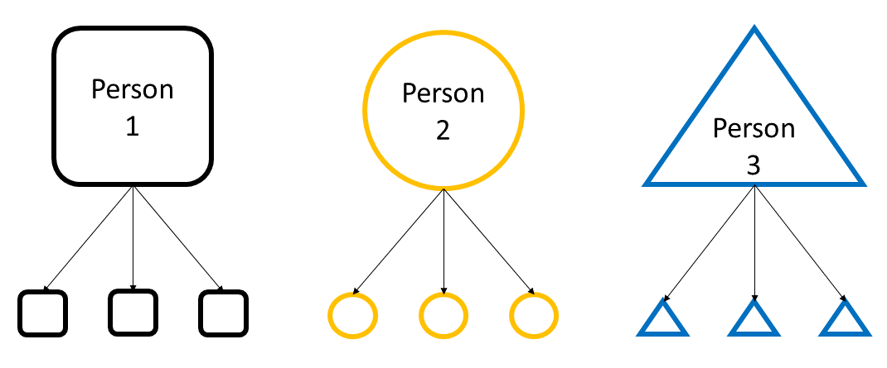

# TIDAL Statistics Guide

The purpose of TIDAL is to make longitudinal data analysis accessible to people without a background in statistics, but we include here a brief description of the statistics used for those interested.

## Longitudinal data

Longitudinal data refers to information collected from the **same people, over time**. In contrast to cross-sectional data, longitudinal data also allows researchers to analyse trends over time. 

For example, consider a study such as the [Millennium Cohort Study](https://cls.ucl.ac.uk/cls-studies/millennium-cohort-study/) investigating how depression symptoms change during childhood and adolescence: 

Researchers recruit a sample of children and have their parents report on their child's depression symptoms. Over the next 10 years, researchers measure the children's depression symptoms four more times. This leads to 5 measurements of depression symptoms for each child in the study.

They want to know how the rate of depression changes as children grow older. This longitudinal data can tell us that young children have low levels of depression symptoms, but as they enter adolescence these rates of depression increase. Using this data, the researchers could also study if boys and girls differ in this increase in depression - perhaps girls have a more extreme increase in depression than boys do. 

## Analysing Longitudinal Data with Mixed Effects Models

TIDAL uses **mixed effects modelling** to analyse longitudinal data. These models are also sometimes known as *multilevel models* or *mixed models*.

Mixed effects models are useful in analysing longitudinal measures, as taking repeated measurements from the same individuals means that our data points are not [independent](https://www.statology.org/assumption-of-independence/). This means that statistical tests such as t-tests, ANOVA and linear regressions cannot typically be used.

In a longitudinal study, each person has multiple measurements taken. Each of these individual measurements, or data points, can be thought of as belonging to a particular person. This is known as *nesting* or *grouping* - the person who the data came from is our grouping factor. 

In mixed effects models, we estimate both *fixed effects* and *random effects*. Fixed effects are similar to the results of a standard linear regression - they are the effect of our predictive or explanatory variable on our outcome variable. In contrast, random effects allow us to control for the grouping factors that make our data points violate independence. The estimates from random effects capture the differences in our outcome due to the differences between levels of our grouping variable (in this case, people).

## Further reading (external links)
[A beginner's introduction to mixed effects models](https://meghan.rbind.io/blog/2022-06-28-a-beginner-s-guide-to-mixed-effects-models/)

[An introduction to linear mixed-effects modeling in R](https://journals.sagepub.com/doi/10.1177/2515245920960351)

[What is a mixed effects model](https://www.statstest.com/mixed-effects-model/#What_is_a_Mixed_Effects_Model)

[Linear mixed models for longitudinal data](https://boostedml.com/2018/12/linear-mixed-models-for-longitudinal-data.html)