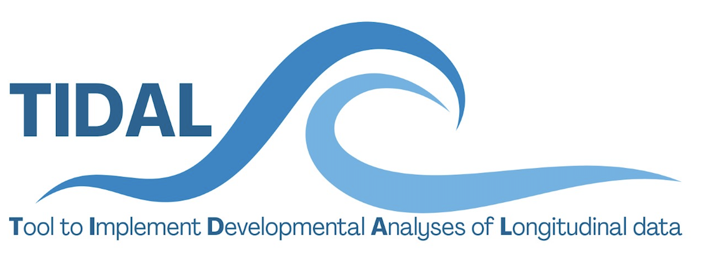

``` {r, echo=F, warning=F}
library(knitr)
library(kableExtra)
library(ggplot2)


```

``` {r, echo = F}
vartype = if(params$condtype == "cat"){"Categorical"} else {"Continuous"}
```


# TIDAL Interaction Variable

For more information, see the [TIDAL GitHub page](https://github.com/AmeliaES/TIDAL)

Date generated: `r Sys.Date()`

Phenotype: `r params$traj`

Condition: `r params$cond`

Condition type: `r vartype`

`r params$condModelForm`

Model type: `r params$modelType`


``` {r, echo = F}

params$condPlot

```

## Fixed effects

```{r, echo=F}
kbl(params$condFixed[,3:ncol(params$condFixed)], digits = 3)  %>%
  kable_styling(latex_options = "hold_position")
```


## Random effects

```{r, echo=F}
kbl(params$condRandom[,3:ncol(params$condRandom)], digits = 3)  %>%
  kable_styling(latex_options = "hold_position")
```


```{r, echo = F, results='asis', warning=F}
if(is.ggplot(params$plotScore)){
cat("### Scores at Ages")
}
```

```{r, echo=F, warning=F}
if(is.ggplot(params$plotScore)){
kbl(t(params$plotScore), digits = 3)  %>%
  kable_styling(latex_options = "hold_position")
}
```


```{r, echo=F, warning=F}
if(is.ggplot(params$plotScore)){
kbl(params$tableScore, digits = 3)  %>%
  kable_styling(latex_options = "hold_position")
}
```


``` {r, echo = F, results='asis', warning=F}
if(is.ggplot(params$AUCplot)){
cat("### Area Under the Curve")
}
```

```{r, echo=F, warning=F}
if(is.ggplot(params$AUCplot)){
params$AUCplot
}
```


```{r, echo=F, warning=F}
if(is.ggplot(params$AUCplot)){
kbl(params$AUCtable, digits = 3)  %>%
  kable_styling(latex_options = "hold_position")
}
```

```{r, echo=F, warning=F}
if(is.ggplot(params$AUCplot)){
  params$difference
}
```

